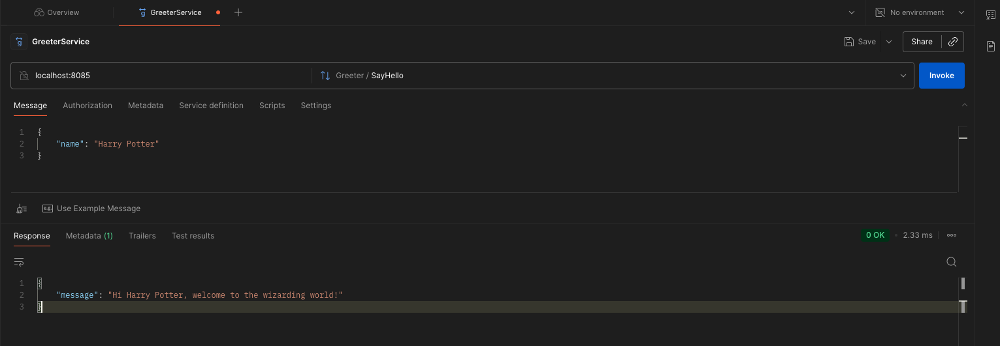

# HelloGRPC

Simple GRPC go code, greeter service.

## Steps to reproduce on your local

**1. clone the repository**

`git clone https://github.com/IdentityStolen/HelloGRPC
cd HelloGRPC`

**2. Go plugins for the protocol compiler:**

Install the protocol compiler plugins for Go using the following commands:

```go
go install google.golang.org/protobuf/cmd/protoc-gen-go@latest
```

Update your PATH so that the protoc compiler can find the plugins:

```markdown
export PATH="$PATH:$(go env GOPATH)/bin"
```

**3. Run command `go mod tidy` to install missing dependancies.**

**4. run following make command to run protoc command that generates go specific code (*.pb.go files)**

`make gen_from_proto`

`5. Now build & run main.go`

```go
go build ./greeter_server/main.go
go run ./greeter_server/main.go
```

Once server is up & running, sample output can be seen using tools like postman. proto file can be imported to choose service. This autocompletes input formats for you!




